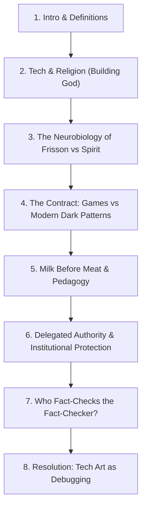

# Editorial Review & Critique: "What Would a World Look Like Without Magical Thinking?"

**Target Document**: `.docs/wip/what-would-a-world-look-like-without-magical-thinking.md`  
**Date**: September 5, 2026  
**Type**: Deep-Dive Rubber Duck Review & Revision Roadmap  

---

## 1. Executive Summary & Core Concept

The essay explores how the psychological and institutional machinery of **magical thinking** operates across three interlocking domains:

1. **Religious Orthodoxy (Mormonism / LDS Theology)**: Priesthood authority by calling, "burning in the bosom" as epistemic proof, "milk before meat" apologetics, institutional self-protection over individual protection.
2. **Game Development / Tech Art (30 Years in AAA)**: Constructing artificial worlds and emotional payoffs while keeping an honest, transparent contract with the player ("this is an illusion, opt in, put the controller down").
3. **Generative AI & Technotheology**: Fluency and pattern-matching mistaken for sentience or spiritual insight; Singularity as eschatology; corporate alignment tuned for legal liability while mimicking empathy.

**Core Thesis**: Magical thinking is not creativity or imagination—it is the learned habit of declaring a feeling or authority "sacred" so that nobody is allowed to check whether the claim is actually true. Its underlying payload is **obedience**.

---

## 2. Strongest Elements & High-Impact Insights

- **The Distinction Between Story and Magical Thinking**: Clarifying in the opening lines that creativity, myth-making, and imagination are humanity's oldest, most vital survival technologies prevents the essay from reading like cold, sterile reductionism.
- **The "Lest They Perish" Analysis ([D&C 19:22](https://www.churchofjesuschrist.org/study/scriptures/dc-testament/dc/19?lang=eng&id=p22#p22))**: Dissecting the scriptural leap from pedagogical pacing to protective gatekeeping (*"withholding facts you are not ready to survive believing"*) is exceptionally sharp and memorable.
- **Neurobiology of Frisson vs. "The Spirit"**: Grounding the emotional swell in fMRI brain scans (nucleus accumbens dopamine response) and comparing musical frisson to religious euphoria effectively deconstructs the feeling-as-proof fallacy without invalidating the subjective sensation itself.
- **Who Fact-Checks the Prophet? / The Regress of Authority**: Demonstrating how turning to Gemini or ChatGPT to fact-check claims often recreates the same chain of delegated authority (ending at corporate legal teams / quarterly earnings calls rather than objective truth).
- **Technical Art as the Positive Alternative**: Framing tech art as active debugging (*"the scientific method with a viewport attached"*) provides an authentic, earned, and inspiring resolution.

---

## 3. Critical Weaknesses, Contradictions & Blind Spots

### A. The "Games Never Lie" Contradiction (Professional Idealization)

- **The Problem**:  
  The essay claims:
  > *"The difference, I think, is that a game never lies to you about what it is... The contract is honest: this is a constructed feeling, opt in, enjoy it, put the controller down when you're done."*
- **The Reality**:  
  Modern game development (especially live-service, free-to-play, mobile, gacha, and algorithmic matchmaking) is heavily weaponized with dark patterns, variable reward schedules (loot boxes, battle passes, artificial friction, FOMO), and predatory behavioral psychology designed specifically to prevent players from putting the controller down.
- **The Risk**:  
  Giving game development an idealized, moral pass while indicting religion and AI opens you to accusations of industry bias.
- **Revision Strategy**:  
  - Reframe the argument around **traditional / single-player / artistic games** versus the **dark forest of modern monetization**.
  - Acknowledge that modern game dev *did* break the contract when it adopted the very behavioral conditioning and variable-ratio dopamine loops you critique elsewhere.
  - Make the distinction ontological: even predatory games don't claim their dragons or loot boxes are metaphysically sacred or physically real in the afterlife.

---

### B. The Burning Man Aside (Authorial Blind Spot)

- **The Problem**:  
  > *## One thing I'm setting aside, on purpose*  
  > *I love Burning Man, and I recognize its woo bears some real kinship to everything I've just described. That's a genuinely interesting thread, but it deserves its own honest excavation rather than a rushed defense bolted onto this piece.*
- **The Reality**:  
  In an essay dedicated to ruthlessly deconstructing sacred cows and unfalsifiable rituals, halting the essay to announce you are exempting your own subculture's "woo" reads like a defensive disclaimer.
- **Revision Strategy**:  
  - **Option 1 (Recommended)**: Delete the section and H2 entirely.
  - **Option 2**: Condense into an integrated parenthetical or single-sentence admission in the intro or conclusion (e.g., *"Whether it's church pews, tech demos, or dust storms at Black Rock..."*).

---

### C. Structural Conflation: Institutional Abuse Protocols vs. AI Alignment Filters

- **The Problem**:  
  Comparing the LDS Kirton McConkie child abuse helpline protocol directly to AI alignment filters and corporate liability safeguards.
- **The Reality**:  
  - The church helpline example involves **systemic moral failure and legal concealment in response to felony abuse**.
  - AI alignment involves **guardrails preventing hallucination, toxic outputs, and medical malpractice liability**.
  - While both reflect institutions shielding themselves from legal exposure, treating them as identical mechanisms risks feeling like a false equivalence.
- **Revision Strategy**:  
  - Clarify the exact connective tissue: **both structures use bureaucratic protocols to interpose organizational risk mitigation between a person in vulnerability and actual truth/safety.**
  - Distinguish clearly between *epistemic gatekeeping* (hiding dogma) and *liability routing* (protecting the institution).

---

### D. Redefinition of "Magical Thinking"

- **The Problem**:  
  The standard psychological definition of magical thinking is believing that internal thoughts, rituals, or symbols directly affect external physical reality (e.g., superstitious rituals, prayer curing disease).  
  The essay expands this to mean **epistemic gatekeeping, dogmatism, and the demand for unearned obedience**.
- **Revision Strategy**:  
  - Clarify early that you are examining how magical thinking becomes weaponized: starting as a belief that feeling equals reality, and ending as an institutional system that forbids verification.

---

### E. Experiential Asymmetry (LDS Specificity vs. AI Abstraction)

- **The Problem**:  
  The religious sections are deeply textured with primary sources, scriptures, personal history, fMRI data, and investigative reporting. The AI sections lean more on high-level executive quotes and broad references to chatbots.
- **Revision Strategy**:  
  - Add concrete, tactile examples from your day-to-day workflow with AI systems (e.g., prompting hallucinations, model confidence vs. accuracy, developers treating probabilistic completions as intuitive wisdom).

---

## 4. Piece-by-Piece Revision Roadmap

### Action Items

1. [ ] **Refine the Game Contract**: Address the "dark forest" of modern monetization and contrast it with honest world-building.
2. [ ] **Remove or Integrate the Burning Man Heading**: Eliminate the standalone H2 to maintain narrative momentum.
3. [ ] **Tighten the Institutional Parallel**: Clarify how corporate alignment and religious helplines both prioritize institutional self-preservation over user/member welfare without creating a 1:1 moral equivalence between child abuse cover-ups and chatbot safeguards.
4. [ ] **Ground the AI Examples**: Weave in specific, grounded experiences with AI tools to match the texture of the LDS and game dev insights.
