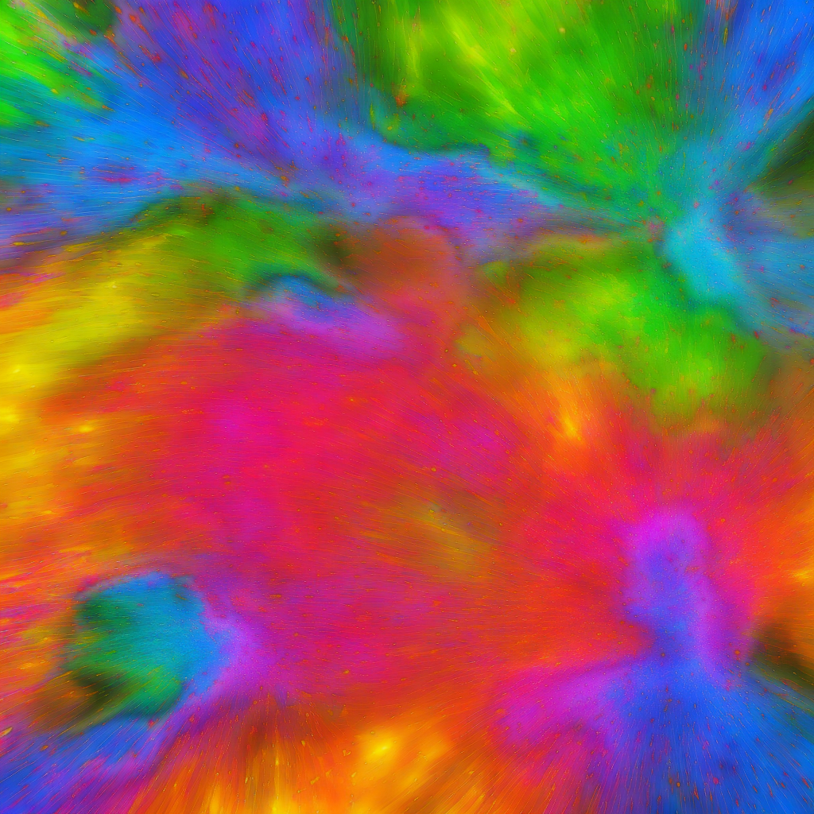

# Welcome to the Co3deX

Hello and welcome to the Open 3D Engine CO3DEX, a blog of my Journey's in Real-time 3D Graphics, Design Technology and Technical Art. My name is Jonny Galloway, I work for @AWSCloud & my opinions are my own.

## Understanding Image Frequency Separation

### Macro Color and Detail Mapping

This article helps us understand the importance of *Frequency Separation* (FS), which is a technique used in image editing to separate the high-frequency details, such as texture and blemishes, from the low-frequency information, such as color and tone. This allows the editor to make adjustments to these different elements separately, allowing for more precise and targeted edits. For example, the Image Author could use frequency separation to smooth out the skin tone of a portrait without losing the texture of the skin, or to remove blemishes without affecting the overall skin tone. The technique involves creating two layers in the image, one for the high frequencies and one for the low frequencies, and then using blurring and other techniques to separate the two layers. Frequency separation can be a useful tool in a variety of editing situations, including portrait retouching, product photography, and landscape editing.

As noted above, the frequency separation technique which is most often used in retouching photos, however it can also be a useful technique to understand and apply technically to the creating of textures for use in shading techniques.  For example, as we will explore,  frequency separation can be used as part of a workflow for generating macro color maps and high-frequency terrain detail materials for use in 3D graphics.  You may already know about *high pass filtering* and this is also related to that (for instance, *high pass terrain detail maps.*)  First we will explain frequency separation as a concept, then we will utilize it with a terrain detail texture.

## Basic Frequency Separation

Let's take a working example:

We have a colorful image with lots of color and detail, we are going to separate out the low frequency and high frequency data.

This is a manual process for separating low / high frequency in an image editor like Photoshop.  YES, there is a *high pass* filter available in Photoshop but ...

1. It doesn't give us the matching low pass (although there is another process we could use to get that by removing the high pass from original, to generate the low pass, and we will cover that later)

2. The other benefit here is having full control over the low pass data (and we get to understand HOW the high pass filter actually works)

Layer Setup

Here is our original image, we are going to prepare the frequency separation in a manner that is similar to photo retouching.

| Layer 1                                                                                                                        | Layer 2                                                                                                                                                  | Layer 3   |           |
| ------------------------------------------------------------------------------------------------------------------------------ | -------------------------------------------------------------------------------------------------------------------------------------------------------- | --------- | --------- |
|  | [ image ]                                                                                                                                                | [ image ] |           |
| The original image is in the default "Layer 1"                                                                                 | 1.Duplicate the original image into a new layer called "Layer 2"\\2.In "Layer 2" apply a gaussian blur filter, I used a value of 16 for the blur kernel. | txt       |           |
|                                                                                                                                | txt                                                                                                                                                      | txt       | txt       |
|                                                                                                                                |                                                                                                                                                          | [ image ] | [ image ] |
|                                                                                                                                |                                                                                                                                                          | txt       | txt       |

### Layer Blending

Now, it is possible to combine the _low pass_(layer 2) and the _high pass_(layer 3)

In Photoshop, with "Layer 3" selected, set the layer blend mode of the *high pass to Linear light*

[ image ]

As you can see in the screenshot, we've restored the original image fidelity by properly blending the low + high pass frequencies back together.

## Tiling Textures

**NOTE:  If you are working with tiling image, such as repeating Terrain Detail Textures!**

You will want to use the following steps in order to make sure that both the low pass and high pass will continue to properly tile after the frequency splitting happens:

- Select All
- Edit > Define Pattern ...
  - Save the base image as a pattern
- Image > Canvas Size
  - Width/Height 300%
- Edit > Fill ...
  - Contents: Patterns
  - Custom Pattern: (select the pattern you made previously from the base image)
  - Note:  This fills the image with the pattern, consider it a 3x3 tiled version of you image ... so we can work on the center tile.
- ... now follow the steps up above for splitting the image frequencies ...
- Image > Canvas Size
  - Width/Height: 33.33 ***percent***, or the  in**_ pixels_**

### ***Why***

- Because these steps, allow the Gaussian blur to take into account the wrapped tiling along the adjacent borders.
- So when the *low pass* (blur) is calculated, the pixel information wraps, then when it's subtracted and cropped both the *low pass* and the *high pass* will still tile properly.

## Blending Math

[Linear Light](https://en.wikipedia.org/wiki/Blend_modes#Dodge_and_burn): this blend mode combines *Linear Dodge* and *Linear Burn* (re-scaled so that neutral colors become middle gray). Dodge is applied when the value on the top layer is lighter than middle gray, and burn applies when the top layer value is darker. The calculation simplifies to the sum of the bottom layer and twice the top layer, subtract 1. This mode decreases the contrast.

Let's explore how that can happen (here's the missing math in GLSL shader code):

**LinearLight**

```glsl
/*
** Basic math
*/
#define BlendAddf(base, blend)          min(base + blend, 1.0)
#define BlendSubstractf(base, blend)    max(base + blend - 1.0, 0.0)

/*
** Redefined in Photoshop terms
*/
#define BlendLinearDodgef               BlendAddf
#define BlendLinearBurnf                BlendSubstractf


/* Linear Light */
#define BlendLinearLightf(base, blend)  (blend < 0.5 ? BlendLinearBurnf(base, (2.0 * blend)) : BlendLinearDodgef(base, (2.0 * (blend - 0.5))))
```

Here is the equivalent blending code from the Lumberyard *Terrain.fxc* fragment shader:

**Lumberyard, terrain.fxc**

```hlsl
// Put back in gamma space to keep look of old blending modes (Note this assumes SRGB always enabled)
baseColor.xyz = sqrt(baseColor.xyz);

// material color is offseted from base
pPass.cDiffuseMap.xyz = saturate(baseColor.xyz + ((pPass.cDiffuseMap-0.5h) * DetailTextureStrength));

// Put back in linear space (Note this assumes SRGB always enabled)
pPass.cDiffuseMap.xyz *= pPass.cDiffuseMap.xyz;
```

And here is the equivalent blending code for the Open 3D Engine StandradPBR material code, found in the following file [BlendUtility.azsli](https://github.com/o3de/o3de/blob/development/Gems/Atom/Feature/Common/Assets/ShaderLib/Atom/Features/BlendUtility.azsli):

**BlendUtility.azsli**

```hlsl
/*
 * Copyright (c) Contributors to the Open 3D Engine Project.
 * For complete copyright and license terms please see the LICENSE at the root of this distribution.
 *
 * SPDX-License-Identifier: Apache-2.0 OR MIT
 *
 */

#pragma once

#include <Atom/Features/ColorManagement/TransformColor.azsli>

enum class TextureBlendMode { Multiply, LinearLight, Lerp, Overlay };

// See https://en.wikipedia.org/wiki/Blend_modes#Dodge_and_burn
float3 TextureBlend_LinearLight(float3 base, float3 mask)
{
    return saturate(base + 2 * mask - 1);
}

...

//! General purpose utility function for applying a blend between two colors. Note that the order of the colors is not commutative (for most blend modes).
//! @param color - The main color or target color for the blend
//! @param blendColor - The secondary color that will be blended into the main color
//! @param factor - A factor that controls the blend. The specific behavior depends on the blend mode.
//! @param blendMode - Indicates the type of blend to perform
//! @return the resulting blended color
float3 ApplyTextureBlend(float3 color, float3 blendColor, float factor, TextureBlendMode blendMode)
{
    ...

    else
    {
        // To get blend behavior that mimics photoshop, convert to sRGB
        float3 blendColorSRGB = TransformColor(blendColor, ColorSpaceId::ACEScg, ColorSpaceId::SRGB);
        float3 colorSRGB = TransformColor(color, ColorSpaceId::ACEScg, ColorSpaceId::SRGB);

        float3 finalColor = colorSRGB;

        if(blendMode == TextureBlendMode::LinearLight)
        {
            finalColor = TextureBlend_LinearLight(colorSRGB, blendColorSRGB);
        }

        ...

        // Convert back to ACEScg
        finalColor = TransformColor(finalColor, ColorSpaceId::SRGB, ColorSpaceId::ACEScg);

        // Apply factor
        finalColor = lerp(color, finalColor, factor);

        return finalColor;
    }
}
```

## Recombinatorial Examples

Now that we briefly covered the math, lets try out some other tests with combining the low-pass (color) an high-pass (detail.) This technique provides a lot of flexibility, that actually relates to usage within 3D graphics, such as terrain workflows.  In games, we might feed multiple textures of different resolutions, to different parts of the rendering system, where they are then recombined during shading.

An example might be...

1. A low-resolution [Terrain Macro Material color texture map](https://www.o3de.org/docs/user-guide/components/reference/terrain/terrain-macro-material/)
   
   1x1 texel per-meter in world-space
   
   fed to the terrain system (along with macro height, macro normal map, etc.)

2. A high-frequency _[Terrain Detail Material](https://www.o3de.org/docs/user-guide/components/reference/terrain/terrain-detail-material/)
   
   2048 resolution texels per-meter in world-space
   
   the low-frequency macro color and the high-frequency detail texture are combined during shading.

Some of the benefits of taking this approach:

- Terran macro color can be drawn in the distance without the detail texture and appear correct
- Detail textures can use a LinearLight blend to combine high-frequency details with the underlying macro color (with stable visual results)
- Detail texturing can blend in/out over distance smoothly, triangles in the background can render with less shading instructions (should equal performance gains)
- Detail texturing can blend nicely with modulation and variance in the macro color (e.g. blending along an area where the macro color grades from a light brown to dark brown)
- We can independently manage the resolution of the macro textures and detail materials (which also means we have better control over memory footprints)

We can mimic some of what happens during shading within Photoshop, lets' explore some of these aspects to better understand them.

### Low-Resolution Color

In this example, we are going to muck around with the low pass *and crunch it down* to a much smaller image, then reconstruct the image from two maps of different resolutions. Theoretically, we will loose some information which may decrease aspects like the fidelity, quality and overall data integrity of the image (but hey, we do that ALL the time in real time graphics.)

| Original              | Downsampled       | Interpolated                    | Reconstruction                              | Difference                      |
| --------------------- | ----------------- | ------------------------------- | ------------------------------------------- | ------------------------------- |
| Low-pass, 1024 x 1024 | Low-pass, 16 x 16 | Low-pass, bilinear. 1024 x 1024 | Low-pass (bilinear), blended with high-pass | Original, minus reconcstruction |
| [ image ]             | [ image ]         | [ image ]                       | [ image ]                                   | [ image ]                       |

As you can see in the final reconstructed image (and the diff) that there is not any perceptible loss in quality - in fact, you have to auto-level the hell out of that diff to even visualize the difference they are so minor.

One more try, how low can we go?  Let's drop the low-pass from 1024 pixels, to 64, before recombining.

| Original  | Downsampled | Interpolated | Reconstruction | Difference |
| --------- | ----------- | ------------ | -------------- | ---------- |
| txt       | txt         | txt          | txt            | txt        |
| [ image ] | [ image ]   | [ image ]    | [ image ]      | [ image ]  |

OK - now we are starting to see a perceptible difference in integrity, and the quality is arguably diminished ... but the fidelity as far as using it is _good enough to me._This is basically what will occur in the rendering engine, when a triangle/quad is rendered and reconstructs shading with low-res terrain macro color (1 texel per-meter) and a high-resolution detail texture (2048 textels per-meter)

### Results

Here are all three reconstructions again side-by-side, each is the final reconstructed resolution of 1024 pixels, only the resolution and up-sampling of the low-pass was altered.

| Original        | 64x64 bilinear  | 16x16 bilinear  |
| --------------- | --------------- | --------------- |
| Low-pass: 1024  | Low-pass: 64    | Low-pass: 1024  |
| High-pass: 1024 | High-pass: 1024 | High-pass: 1024 |
| [ image ]       | [ image ]       | [ image ]       |

### Color Alteration

This is a pretty flexible technique, as the high pass frequency can be applied across a wide range of shifts in the low pass base colors and still arrive at decent looking results, here are a few extreme examples:

| Original    | Downsampled    | Interpolated     | Reconstruction |
| ----------- | -------------- | ---------------- | -------------- |
| 1024 pixels | 32 x 32 pixels | Bilinear upscale | Blended        |
| [ image ]   | [ image ]      | [ image ]        | [ image ]      |

And in this next version, we are simple going to hue shift our original low pass colors

| Original    | Downsampled    | Interpolated     | Reconstruction |
| ----------- | -------------- | ---------------- | -------------- |
| 1024 pixels | 32 x 32 pixels | Bilinear upscale | Blended        |
| [ image ]   | [ image ]      | [ image ]        | [ image ]      |

As you can see, we can make pretty abrupt and wild changes to the base color, and still arrive at visually interesting results!

### High Pass Filter

Now let's briefly explore how we can use Photoshop's built-in *high pass filter* to generate our *high pass detail map*, then apply that back to the original to generate the matching *low pass macro texture*

| Generate High-Pass | Linear Burn | Linear Add | Low Pass A | Low Pass B |
| ------------------ | ----------- | ---------- | ---------- | ---------- |
| txt                | txt         | txt        | txt        | txt        |
|                    | [ image ]   | [ image ]  |            |            |

Note: There is a REALLY good chance, there is a correct error free way to do this that I simply haven't figured out yet. And I am guessing, it would be fairly easy to write a python script or some code that would do all of this work and spit out the separated frequencies.

## Terrain Macro Color and Detail Materials

To use frequency separation for the purpose of , you would typically start by obtaining an image of the terrain that you want to create a color map and high-frequency detail material for. This image could be a photograph or a scan of real-world terrain, or it could be a digital image that you have created or obtained from another source.

Next, you would use the frequency separation technique to create two layers in the image: one for the high frequencies and one for the low frequencies. The high frequency layer would contain the detail and texture information, while the low frequency layer would contain the color and tone information.

You could then use the high frequency layer to generate a high-frequency detail material for the terrain, and the low frequency layer to generate a macro color map. These materials could then be used in a 3D graphics application to create a detailed and realistic representation of the terrain.

This approach works well for creating detail materials for terrain, here is the original cry doc that covers this:

*[Creating Terrain Textures and Materials - CRYENGINE 3 Manual - Documentation](http://docs.cryengine.com/display/SDKDOC2/Creating+Terrain+Textures+and+Materials)*

Note: the more *homogeneous (in overall color)* your terrain detail texture is, the more successful this approach.  But let's use the image in their doc.

| Source      | Low-Pass    | High-Pass   | Reconstructed |
| ----------- | ----------- | ----------- | ------------- |
| texture_040 | texture_041 | texture_042 | texture_043   |
|             | txt         | txt         | [ image ]     |
| texture_040 | texture_044 | texture_042 | texture_045   |

## FAQ

**Q: Sniff test ... why should I care about this?**

**A**: This ia a flexible and common approach to_terrain detail_ mapping:

CryEngine reference: _[Creating Terrain Textures and Materials - CRYENGINE 3 Manual - Documentation](http://docs.cryengine.com/display/SDKDOC2/Creating+Terrain+Textures+and+Materials)_

Splitting frequencies gets us:

1. Low-Pass Color
   1. This can be used directly as a texture input, for example in a terrain generator, or the o3de Terrain Macro Material
   2. Can be used to find the average color (down-sample to 1x1), this value can be placed into the color swatch of a StandardPBR material (or Terrain Detail Material)
   3. Or we could use the low pass, to generate a color ramp (and a matching height map), which can be used as input in programs like World Machine to use in *colorization* *[Working with Texture Color Ramps](/display/lmbr/Working+with+Texture+Color+Ramps)*
2. High-Pass, High-Frequency Detail
   1. Load the high-pass as the basecolor texture in a StandardPBR material and set the Blend mode to LinearLight.
   2. This same approach can be used as the detail texture for a standard material, for instance
   3. Use the StandardPBR/TerrainDetailMaterial and blend the material across terrain, including good results when the macro color shifts (for example: an area that transitions from a light brown to a dark brown.)

**Q: Can I just use the High Pass Filter in Photoshop?**

**A:** Yes. See the section above titled 'High Pass Filter'?

- If you don't car about retrieving the low-pass color, then this is fine (and much quicker to perform)
- You can also derive a low-pass color map this way (but it's clunky as shown above)

**Q: What does LinearLight mean?**

**A:** This is covered above, but here is a synopsis:

Speak like an artist... artists that use Photoshop, speak in the terms of Photoshop and Image Editing.  In Photoshop ...

*LinearLight uses a combination of the **Linear** Dodge **blend mode** on the lighter pixels, and the **Linear** Burn **blend mode** on the darker pixels (a half-strength application of both **modes**). Similar to the Vivid **Light blend mode** in overdrive, and typically results in a more extreme effect.*

**Q: Can you tell me how the blending math works?**

**A:** Yes, this is also covered above, but if you want a general crash course on the math here is reference for how to do a lot of Photoshop style_ blending and maths, in shader code:

[WPFSLBlendModeFx/PhotoshopMathFP.hlsl at master · cplotts/WPFSLBlendModeFx · GitHub](https://github.com/cplotts/WPFSLBlendModeFx/blob/master/PhotoshopMathFP.hlsl)

**Q: Do I need to use Photoshop?**

**A:** No. Most popular image editors will handle this, but you may need to google how.  But other applications, such as Adobe Substance 3D Designer, also have ways to work with generating high-pass detail textures (see next question.)

**Q: Can I do something similar with Adobe Substance 3D Designer?**

**A:** Yes. Substance 3D Designer has nodes that perform similar functions to a High Pass Filter:

- [Highpass | Substance 3D Designer](https://substance3d.adobe.com/documentation/sddoc/highpass-159449203.html)
- [Luminance Highpass | Substance 3D Designer](https://substance3d.adobe.com/documentation/sddoc/luminance-highpass-159449246.html)

**Q: Can you give me a rundowon on 'Frequency separation' in game and realtime 3D content, versus it's use on photo retouching?**

**A:** Yes. There are a lot of areas it can be used, here are a few examples:

- Separate macro color and high frequency detail, as described in this document: make a macro color texture, make a detail texture for terrain.
- It can be used to generate high-frequency detail textures for other non-terrain workflows as well, such as repeat patterns for blue jeans, other cloth, and leathers, etc.
- It can similar be used in skin shading workflows, for instance highpass wrinkles and pore maps.
- Image balance: get rid if uneven light and shadow in a material.

## Reference

Cry doc ref related to this:

- [Terrain.Layer Shader - CRYENGINE 3 Manual - Documentation](http://docs.cryengine.com/display/SDKDOC2/Terrain.Layer+Shader)
- [Creating Terrain Textures and Materials - CRYENGINE 3 Manual - Documentation](http://docs.cryengine.com/display/SDKDOC2/Creating+Terrain+Textures+and+Materials)
- [Painting Terrain - CRYENGINE 3 Manual - Documentation](http://docs.cryengine.com/display/SDKDOC2/Painting+Terrain)

General:

- [The Power of the High Pass Filter](https://www.gamedeveloper.com/art/the-power-of-the-high-pass-filter)
- [How to Retouch Skin Using Frequency Separation in Photoshop](https://www.makeuseof.com/photoshop-how-to-retouch-skin-frequency-separation/)
- [[Inverted High Pass (IHP) Retouching Tutorial — Retoucher | Daniel Meadows](https://www.dmd-digital-retouching.com/blog/inverted-high-pass-ihp-retouching-tutorial/)

---

```python
import logging as _logging
_PKGNAME = 'co3dex'
_LOGGER = _logging.getLogger(_PKGNAME)
_LOGGER.info(f'Initializing: {_PKGNAME} ... Frequency Seperation')
```

---
