# Welcome to the Co3deX

Hello and welcome to the CO3DEX, a blog of my Journey's in Real-time 3D Graphics and Technical Art. My name is Jonny Galloway, I am a polymath technical art leader who bridges art, tools, engine, and product. I work as a Principal Technical Artist and tools/engine specialist with 30+ years in AAA game development, working across content, design, production, and technology.

## Don't Thread What You Can't Parallelize: Qt Async Done Right

---

## TL;DR (5-Minute Version)

**Problem:** I inherited a game dev tool that wrapped a sequential subprocess pipeline in threading code, achieving 0% speedup while adding 250 lines of complexity. And made debugging significantly more difficult.

**Root Cause:** Threading doesn't parallelize inherently sequential operations. Each DCC stage (Houdini → Substance → Maya) had to complete before the next could start—no parallel work existed.

**Solution:** Replaced threading with QProcess (Qt's async subprocess tool). Same 3-8 minute runtime, but UI stays responsive, real-time output streaming works, and code is 50% simpler.

**Result:** Removed 150 lines of threading code, eliminated thread-safety bugs, maintained identical performance.

**Core Lesson:** Don't add concurrency unless you have **provably parallelizable work**. If you can't identify truly independent operations, concurrency adds complexity without benefit.

**When Threading DOES Help:** Processing 100 independent texture files in parallel (8x speedup), multiple concurrent API calls, truly parallel I/O operations.

**Read on for:** Complete code examples, decision frameworks, misconception analysis, and when to use Threading vs QProcess vs Async vs Blocking code.

---

## The Sequel: When Logging Reveals Architectural Problems

In my [last post](/blog/tool-logging-with-python/), I walked through how proper logging transformed a fragile prototype game development tool into something debuggable and maintainable. I added hierarchical logging, real-time process monitoring, and defensive validation that caught errors before they cascaded.

But here's the thing about good logging: **it doesn't just reveal bugs—it reveals broken architecture.**

As I dug into the logs from that High to Game Ready tool, patterns emerged. Thread-safety warnings. Signal race conditions. UI freezes that shouldn't happen. The logging was working perfectly, showing me exactly what was wrong. The problem? The entire concurrency architecture was fundamentally flawed.

Today I'm sharing the second chapter of that tool's transformation: **how I removed 150 lines of unnecessary threading code, made the UI truly responsive, and simplified maintenance—all without sacrificing a single millisecond of performance.**

This is the story of threading anti-patterns, the misconceptions that lead to them, and the correct solution I should have used from the start.

**Here's what I learned refactoring the tool:**

- **The Problem:** Adding threading or async to inherently sequential, blocking operations provides **zero performance benefit** while adding significant complexity, maintenance burden, and potential bugs.

- **The Core Lesson:** Don't add concurrency unless you have **provably parallelizable work**. If each step depends on the previous step completing, threading won't help—period.

- **The Solution (for my case):** For this sequential DCC pipeline, I refactored to use **QProcess** instead of threading. It provides true async subprocess execution integrated with the event loop, without any of the threading complexity.

**Important caveat:** QProcess was the right solution for **my specific scenario**—a sequential subprocess pipeline. Threading can absolutely be the correct choice when you have truly parallelizable work (like processing 100 independent texture files). I'll cover when threading IS correct later in this post.

But I'm getting ahead of myself. Let me show you the mess I inherited first.

---

## The Inheritance: Threading Spaghetti

Let me paint the picture of what I inherited:

**The Tool's Purpose:**
A Python/PySide application that processes game assets through a 3-stage pipeline:

1. **Houdini** - Geometry reduction (high poly → game-ready low poly)
2. **Substance Designer** - Texture baking (normal maps, AO, etc.)
3. **Maya** - Final export and validation

**Processing Scale:**
- Asset batch size: 10-50 high-poly rock meshes per run
- File sizes: 500MB-2GB per FBX (high-detail scanned geometry)
- Pipeline runtime: 3-8 minutes depending on asset count and complexity

Each stage took 1-3 minutes per batch. Users would click "Run" and wait, watching a progress console for status updates.

**The Implementation I Inherited:**

```python
# Original approach - threading wrapper around blocking subprocess
class HighToGameReadyTool(QMainWindow):
    def __init__(self):
        super().__init__()
        self.threadpool = QThreadPool()  # Thread pool for "async" execution

    def _houdini_process_task(self):
        """Wrapper to run Houdini in thread"""
        if BP_PY_TOOL_RUN_THREADED:
            # Create worker thread
            worker = Worker(self._run_houdini_subprocess)
            worker.signals.interrupt.connect(self.handle_worker_error)
            worker.signals.finished.connect(self.houdini_finished.emit)
            self.threadpool.start(worker)  # Run in background thread
        else:
            self._run_houdini_subprocess()  # Direct blocking call

    def _run_houdini_subprocess(self):
        """The actual subprocess execution - THIS BLOCKS ANYWAY"""
        process = subprocess.Popen(
            [houdini_exe, script_path, *args],
            stdout=subprocess.PIPE,
            stderr=subprocess.PIPE
        )

        # Read output line by line - BLOCKING I/O
        for line in iter(process.stdout.readline, b''):
            decoded = line.decode('utf-8').strip()
            _LOGGER.info(f"[Houdini] {decoded}")

        # Wait for completion - BLOCKING WAIT
        process.wait()
        return process.returncode
```

On the surface, this looks reasonable. Threading! Non-blocking! Modern best practices! Right?

**Wrong.**

Let me show you why this code achieved **exactly zero performance benefit** while adding significant complexity, maintenance burden, and potential for race condition bugs to my tool.

---

## The Execution Flow Reality

Here's what actually happened when a user clicked "Run":

```
User clicks "Run" button
  ↓
Main thread creates Worker thread (overhead: ~10ms)
  ↓
Worker thread spawns Houdini subprocess
  ↓
Worker thread BLOCKS reading stdout (subprocess takes 2-5 minutes)
  ↓
Subprocess processes files SEQUENTIALLY (external C++ process, not Python)
  ↓
Worker thread BLOCKS on process.wait()
  ↓
Worker thread emits signal: houdini_finished
  ↓
Main thread receives signal, marshals across thread boundary (overhead: ~5ms)
  ↓
Main thread spawns Substance subprocess in new worker thread
  ↓
Worker thread BLOCKS waiting for Substance (subprocess takes 1-3 minutes)
  ↓
Repeat for Maya subprocess
  ↓
Finally complete after 3-8 minutes
```

**Total parallelism achieved: ZERO**

**Total complexity added: ~150 lines of threading code + Worker class + QThreadPool + signal marshalling**

**Performance difference vs. direct blocking calls: None. Actually slightly slower due to thread creation/marshalling overhead.**

The threading achieved nothing because:

1. **Each subprocess is inherently sequential** - Houdini must finish before Substance can start (needs Houdini's output files)
2. **The subprocess itself blocks** - Whether in a thread or not, `process.wait()` blocks the thread waiting for the external process
3. **External process does the work** - Houdini runs as a separate OS process. Threading in Python doesn't make C++ code faster
4. **No parallel work exists** - We can't start Substance until Houdini produces files

---

## Misconception #1: "Threading Makes Things Faster"

This is the most pervasive lie developers tell themselves. Let me be crystal clear:

**Threading only helps if you have independent, parallelizable work.**

### Example of GOOD Threading

Here's when threading actually provides value:

```python
# Multiple independent API calls that CAN run simultaneously
from concurrent.futures import ThreadPoolExecutor

def fetch_asset_metadata(asset_id):
    """Each call is independent, takes 1 second"""
    response = requests.get(f"https://api.example.com/assets/{asset_id}")
    return response.json()

def fetch_all_assets_parallel(asset_ids):
    """Fetch 10 assets in ~1 second instead of ~10 seconds"""
    with ThreadPoolExecutor(max_workers=10) as executor:
        futures = [executor.submit(fetch_asset_metadata, id) for id in asset_ids]
        results = [f.result() for f in futures]
    return results

# Performance improvement: 10x faster (10 seconds → 1 second)
# Why it works: Each API call is I/O bound and independent
# While waiting for network responses, threads can make other calls
```

This works because:

- **Independent work** - Fetching asset #1 doesn't depend on asset #2's data
- **I/O bound** - Time spent waiting for network responses (CPU idle)
- **Parallelizable** - 10 threads can wait for 10 different responses simultaneously

### Example of BAD Threading (Our Case)

Now look at my pipeline:

```python
# Sequential pipeline where each step DEPENDS on the previous
def process_assets_sequential():
    # Step 1: Must complete first
    high_files = gather_high_poly_files()

    # Step 2: CANNOT start until Step 1 produces output files
    houdini_result = run_houdini_subprocess(high_files)  # BLOCKS for 2-5 min
    low_files = houdini_result.output_files

    # Step 3: CANNOT start until Step 2 produces output files
    substance_result = run_substance_subprocess(low_files)  # BLOCKS for 1-3 min
    texture_files = substance_result.output_files

    # Step 4: CANNOT start until Step 3 produces output files
    maya_result = run_maya_subprocess(texture_files)  # BLOCKS for 1-2 min

    return maya_result

# Adding threads here provides ZERO benefit because:
# - Each step blocks waiting for external process
# - Each step MUST complete before next can begin
# - No parallel work exists
# - External processes (Houdini/Substance/Maya) do the actual work
```

**Key Insight:** You can't parallelize inherently sequential operations. Threading won't make Houdini process files faster. It just adds complexity with no performance gain.

### Benchmark Reality: The Numbers Don't Lie

Here's actual timing data from processing a 50-rock batch (measured 2026-02-15):

| Stage     | Threading Approach | QProcess Approach | Difference |
|-----------|-------------------|-------------------|------------|
| Houdini   | 4m 12s           | 4m 10s           | -2s        |
| Substance | 2m 8s            | 2m 9s            | +1s        |
| Maya      | 1m 45s           | 1m 44s           | -1s        |
| **Total** | **8m 5s**        | **8m 3s**        | **-2s**    |

**Threading overhead:** ~10ms per stage (thread creation + signal marshalling)

**Actual speedup from threading:** 0% (difference within measurement noise)

**Why no speedup?** 95% of time is spent in external C++ processes (Houdini/Substance/Maya), not Python code. Threading Python doesn't make C++ faster.

---

## Misconception #2: "Non-Blocking UI Requires Threading"

The second major misconception: "If I want a responsive UI, I must use threading."

This is only half true. The full truth is more nuanced.

### When Threading Helps UI Responsiveness

Threading legitimately helps when:

- **User can do other work** while waiting (open another tab, edit settings, browse results)
- **Background tasks are truly independent** (auto-save, cache warming, thumbnail generation)
- **Cancellation requires coordination** (need to signal thread to stop gracefully)

### When Threading Doesn't Help (My Case)

In my tool:

- **User can't do anything else** - They need to wait for the pipeline to complete
- **Main window can't start another process** - Sequential dependencies prevent parallel execution
- **Progress is linear** - Step 1 → Step 2 → Step 3, no branching

**The Original "Solution":**

```python
# Separate progress window with threading complexity
class HighToGameReadyTool(QMainWindow):
    def process_all(self):
        # Show separate progress dialog
        self.progress_bar = BP_Progress_Bar(parent=self)
        self.progress_bar.show()

        # Wrap in thread
        worker = Worker(self._process_pipeline)
        worker.signals.progress.connect(self.progress_bar.update)
        worker.signals.finished.connect(self.progress_bar.close)
        self.threadpool.start(worker)

        # User still can't interact with main UI during processing
        # Progress bar just shows status
        # What did threading accomplish? Nothing.
```

**A Better Approach (Before I Found the Best Solution):**

```python
# Modal progress dialog - simple and honest about blocking
def process_all(self):
    progress = QProgressDialog("Processing...", "Cancel", 0, 100, self)
    progress.setWindowModality(Qt.WindowModal)
    progress.show()

    # Process directly, update progress
    progress.setValue(10)
    self._process_houdini()

    progress.setValue(40)
    self._process_substance()

    progress.setValue(70)
    self._process_maya()

    progress.setValue(100)

    # Advantages:
    # - No threading complexity
    # - Honest about blocking (modal dialog)
    # - User knows they're waiting
    # - No race conditions
    # - 100 fewer lines of code
```

This is better, but I found an even better solution (keep reading).

---

## Misconception #3: "Async/Await is Always Better"

The third misconception comes from the modern async hype cycle. Twitter/Reddit/HackerNews are full of posts like "You should be using async!" and "Stop using blocking code!"

**Reality check:** Async is a tool for specific use cases. Using it everywhere adds complexity without benefit.

### When Async/Await Actually Helps

```python
# Multiple independent I/O operations that can overlap
import asyncio

async def fetch_from_api(url):
    """Single API call using async HTTP client"""
    async with aiohttp.ClientSession() as session:
        async with session.get(url) as response:
            return await response.json()

async def fetch_multiple_resources():
    """Fetch multiple resources concurrently"""
    results = await asyncio.gather(
        fetch_from_api("https://api1.example.com/data"),  # Waiting for network
        fetch_from_api("https://api2.example.com/data"),  # Waiting for network
        fetch_from_api("https://api3.example.com/data"),  # Waiting for network
    )
    return results

# All three fetch simultaneously while waiting for I/O
# Single-threaded event loop manages concurrency
# Performance: 3x faster than sequential
```

This works because:

- **I/O-bound operations** - Time spent waiting for network
- **Independent requests** - One doesn't depend on another's result
- **Async all the way down** - Using async HTTP client (aiohttp)

### When Async Doesn't Help (My Case)

```python
# Sequential dependencies - async adds nothing
async def process_pipeline():
    # Step 1: Must complete first
    high_files = await gather_high_files()  # Async file scanning

    # Step 2: MUST wait for Step 1 to complete
    low_files = await run_houdini(high_files)  # Subprocess blocks

    # Step 3: MUST wait for Step 2 to complete
    textures = await run_substance(low_files)  # Subprocess blocks

    # Step 4: MUST wait for Step 3 to complete
    result = await run_maya(textures)  # Subprocess blocks

    return result

# Problems:
# - No parallelism (each await blocks the next step)
# - Added async/await keywords everywhere (complexity)
# - subprocess.Popen() isn't even async-compatible
# - Would need asyncio.create_subprocess_exec()
# - Result: More code, same performance
```

**Key Insight:** `async`/`await` doesn't magically parallelize sequential operations. It's syntactic sugar for managing concurrent I/O, not a performance silver bullet.

---

## Root Cause Analysis: How Did We Get Here to Begin With?

Understanding how this code came to exist is important for preventing it in the future. This isn't about blaming the previous developer—it's about recognizing a common journey that leads to over-engineering.

**Here's the pattern in a nutshell:**

**The Developer's Journey:**
1. **Reads about async/threading** - "This makes things faster!"
2. **Sees UI freeze during processing** - "I need to make this non-blocking!"
3. **Adds threading wrapper** - "Now it's in a thread, problem solved!"
4. **Tests with small dataset** - "UI is responsive, it works!"
5. **Ships it** - Threading code remains even though it provides no value

**What Was Missed:**
1. **Problem identification** - Why does the UI freeze? (Not CPU-intensive work, but subprocess blocking and nothing else to do anyway)
2. **Requirements analysis** - What does "non-blocking" mean here? (User can't interact, can't start another process, just sequential dependencies)
3. **Solution evaluation** - Does threading help? (Subprocess already runs in separate process, threading adds complexity without enabling parallelism)

Let me break down each phase in detail.

### The Typical Developer Journey

**Phase 1: Initial Problem**

- Developer builds tool with blocking subprocess calls
- UI freezes during the 3-8 minute pipeline
- Users complain: "Is it hung? How do I know it's working?"

**Phase 2: Research**

- Google: "Python non-blocking subprocess"
- Finds articles about threading and async
- Sees code examples: "Run subprocess in thread!"
- Thinking: "Threading makes things faster, right?"

**Phase 3: Implementation**

- Adds QThreadPool, Worker class, signal connections
- Wraps subprocess call in thread
- Tests with small dataset (30 seconds)
- UI remains responsive! Success!

**Phase 4: Shipping**

- Code passes review (threading is "best practice")
- Ships to production
- Works fine (UI is responsive)
- Developer moves on to next project

**Phase 5: Maintenance Nightmare**

- 6 months later, new dev inherits code
- Sees thread-safety warnings in logs
- Sees signal marshalling delays
- Sees race conditions on globals
- Sees 150 lines of threading complexity
- Asks: "Why is this threaded? What's the benefit?"
- Answer: None. It never had a benefit.

### What Was Missed in the Analysis

The original developer missed three critical questions:

**1. Problem Identification - Why does the UI freeze?**

_Wrong Answer:_ "Because the subprocess is CPU-intensive and blocks the main thread."

_Right Answer:_ "Because subprocess.Popen() with blocking I/O reads stdout/stderr synchronously. The subprocess itself runs as a separate OS process (already not blocking Python), but _reading_ its output blocks."

**2. Requirements Analysis - What does 'non-blocking' actually mean?**

_Wrong Answer:_ "Make the subprocess run in a background thread."

_Right Answer:_

- Can user interact with the UI during processing? (No, they just watch progress)
- Can user start another process? (No, sequential dependencies)
- Do we need real-time output? (Yes!)
- Can we capture stdout/stderr without blocking? (Yes, with proper async I/O)

**3. Solution Evaluation - Does threading actually help?**

_Wrong Answer:_ "Yes, because it moves blocking calls off the main thread."

_Right Answer:_

- Subprocess already runs in separate OS process (not blocking Python)
- Thread still blocks waiting (no parallel work exists)
- Threading adds complexity without enabling parallelism
- Result: **Zero performance benefit, increased maintenance burden**

---

## The Actual Solution (for this tool): QProcess

After analyzing the architecture with better logging, the solution became obvious: **QProcess**, Qt's built-in class for running external programs asynchronously.

QProcess is what they should have used from the start. Let me show you why.

### What is QProcess?

QProcess is Qt's native way to run external programs. Unlike threading approaches, it integrates directly with Qt's event loop and provides **true non-blocking subprocess execution**.

**Key Features:**

1. **Non-blocking** - `.start()` returns immediately, subprocess runs in background
2. **Event-driven** - Signals for stdout/stderr/completion (no polling, no blocking)
3. **Real-time I/O** - Stream output as it's produced, line by line
4. **Environment control** - Set custom environment per subprocess
5. **Qt-native** - No manual thread management, works with event loop
6. **Cross-platform** - Works on Windows/Linux/macOS

### Why QProcess Instead of Threading?

Let's compare the approaches directly:

**Threading Approach (What They Had - WRONG):**

```python
# Thread wrapper around blocking subprocess
class ToolWindow(QMainWindow):
    def __init__(self):
        super().__init__()
        self.threadpool = QThreadPool()

    def run_houdini_threaded(self):
        """Start Houdini in background thread"""
        worker = Worker(self._run_houdini_subprocess)
        worker.signals.finished.connect(self.on_houdini_finished)
        self.threadpool.start(worker)

    def _run_houdini_subprocess(self):
        """Runs in worker thread - but still blocks that thread"""
        process = subprocess.Popen(
            [houdini_exe, script_path],
            stdout=subprocess.PIPE,
            stderr=subprocess.PIPE
        )

        # Thread BLOCKS here reading output
        for line in iter(process.stdout.readline, b''):
            decoded = line.decode('utf-8').strip()
            # Cross-thread signal emission
            self.log_signal.emit(f"[Houdini] {decoded}")

        # Thread BLOCKS here waiting for completion
        process.wait()
        return process.returncode

# Problems:
# - Worker thread still blocks (no parallel work achieved)
# - Signal marshalling across thread boundary
# - Thread-safety concerns for shared state
# - ~50 lines of boilerplate (Worker class, signals, thread pool)
# - No real-time output (buffering in thread)
```

**QProcess Approach (What I Implemented - RIGHT):**

```python
# Qt-native async subprocess
class ToolWindow(QMainWindow):
    # Signals for pipeline orchestration
    houdini_finished = Signal()
    substance_finished = Signal()
    maya_finished = Signal()

    def __init__(self):
        super().__init__()
        self._houdini_process = None

        # Connect pipeline: each stage triggers the next
        self.houdini_finished.connect(self.houdini_post)
        self.substance_finished.connect(self.substance_post)
        self.maya_finished.connect(self.maya_post)

    def _start_houdini_qprocess(self):
        """Start Houdini using QProcess - returns immediately"""
        self._houdini_process = QProcess(self)

        # Connect signals (Qt event loop handles everything)
        self._houdini_process.readyReadStandardOutput.connect(
            self._on_houdini_stdout
        )
        self._houdini_process.readyReadStandardError.connect(
            self._on_houdini_stderr
        )
        self._houdini_process.finished.connect(
            self._on_houdini_finished
        )
        self._houdini_process.errorOccurred.connect(
            self._on_houdini_error
        )

        # Set environment for subprocess isolation
        env_dict = load_json_environment(BP_HOUDINI_ENV_JSON)
        env_list = [f"{k}={v}" for k, v in env_dict.items()]
        self._houdini_process.setEnvironment(env_list)

        # Start process - RETURNS IMMEDIATELY, doesn't block
        self._houdini_process.start(hython_exe, [script_path, *args])

        self.logger.info(f"Started Houdini subprocess (PID: {self._houdini_process.processId()})")

    @Slot()
    def _on_houdini_stdout(self):
        """Called automatically when stdout has data - NO BLOCKING"""
        data = self._houdini_process.readAllStandardOutput().data().decode('utf-8')
        for line in data.splitlines():
            if line.strip():
                self.logger.info(f"[Houdini] {line}")
                # Update UI console in real-time
                self.console_widget.append(f"[Houdini] {line}")

    @Slot()
    def _on_houdini_stderr(self):
        """Called automatically when stderr has data"""
        data = self._houdini_process.readAllStandardError().data().decode('utf-8')
        for line in data.splitlines():
            if line.strip():
                self.logger.warning(f"[Houdini ERROR] {line}")

    @Slot(int, QProcess.ExitStatus)
    def _on_houdini_finished(self, exit_code, exit_status):
        """Called automatically when process completes"""
        if exit_code == 0 and exit_status == QProcess.NormalExit:
            self.logger.info("✓ Houdini completed successfully")
            self.houdini_finished.emit()  # Trigger next stage
        else:
            self.logger.error(f"✗ Houdini failed with code {exit_code}")
            self._handle_houdini_error(exit_code)

    @Slot(QProcess.ProcessError)
    def _on_houdini_error(self, error):
        """Called if process fails to start or crashes"""
        error_strings = {
            QProcess.FailedToStart: "Failed to start",
            QProcess.Crashed: "Process crashed",
            QProcess.Timedout: "Process timed out",
            QProcess.WriteError: "Write error",
            QProcess.ReadError: "Read error",
            QProcess.UnknownError: "Unknown error"
        }
        self.logger.error(f"Houdini process error: {error_strings.get(error, 'Unknown')}")

# Advantages:
# - No threading complexity
# - No signal marshalling across threads
# - Real-time output (Qt event loop delivers instantly)
# - Qt handles all concurrency (no race conditions)
# - UI remains responsive (event loop keeps processing events)
# - Clean, readable code
# - ~30 lines (vs 50+ for threading approach)
```

### Pipeline Orchestration with Signals

The elegant part is how I chain the stages together:

```python
def houdini_post(self):
    """Called when Houdini completes - post-process and start next stage"""
    self.logger.info("Post-processing Houdini outputs...")

    # Validate output files exist
    if self._validate_houdini_outputs():
        # Start next stage
        self._start_substance_qprocess()
    else:
        self.logger.error("Houdini outputs failed validation")
        self._handle_pipeline_error()

def substance_post(self):
    """Called when Substance completes - post-process and start next stage"""
    self.logger.info("Post-processing Substance outputs...")

    # Validate textures
    if self._validate_substance_outputs():
        # Start final stage
        self._start_maya_qprocess()
    else:
        self.logger.error("Substance outputs failed validation")
        self._handle_pipeline_error()

def maya_post(self):
    """Called when Maya completes - finalize pipeline"""
    self.logger.info("Post-processing Maya outputs...")

    # Final validation and cleanup
    if self._validate_maya_outputs():
        self._finalize_successful_pipeline()
    else:
        self._handle_pipeline_error()
```

**Signal chain:**

```
User clicks "Run"
  ↓
_start_houdini_qprocess() → returns immediately
  ↓
[Qt event loop processes events, UI stays responsive]
  ↓
Houdini process completes → _on_houdini_finished()
  ↓
houdini_finished signal emitted
  ↓
houdini_post() slot receives signal
  ↓
_start_substance_qprocess() → returns immediately
  ↓
[Qt event loop processes events, UI stays responsive]
  ↓
Substance process completes → _on_substance_finished()
  ↓
substance_finished signal emitted
  ↓
substance_post() slot receives signal
  ↓
_start_maya_qprocess() → returns immediately
  ↓
[Qt event loop processes events, UI stays responsive]
  ↓
Maya process completes → _on_maya_finished()
  ↓
maya_finished signal emitted
  ↓
maya_post() slot receives signal
  ↓
_finalize_pipeline() → Complete!
```

Throughout this entire 3-8 minute pipeline:

- **UI never freezes** - Event loop keeps running
- **Output streams in real-time** - No buffering delays
- **No threads** - Single main thread + Qt's internal I/O threads
- **Clean architecture** - Signal/slot pattern is explicit and debuggable

---

## The Transformation: Metrics and Results

Let's quantify what I achieved by replacing threading with QProcess.

### Code Metrics

**Before (Threading Approach):**

```
Worker class:                  ~50 lines
QRunnable wrapper:             ~30 lines
Signal definitions:            ~20 lines
Thread pool management:        ~15 lines
Separate progress dialog:     ~100 lines
Thread-safety guards:          ~35 lines
─────────────────────────────────────
Total threading overhead:     ~250 lines

Main tool implementation:     ~800 lines
─────────────────────────────────────
Total:                       ~1050 lines
```

**After (QProcess Approach):**

```
QProcess setup (Houdini):      ~60 lines
QProcess setup (Substance):    ~60 lines
QProcess setup (Maya):         ~60 lines
Signal/slot connections:       ~20 lines
─────────────────────────────────────
Total async overhead:         ~200 lines

Main tool implementation:     ~800 lines
─────────────────────────────────────
Total:                       ~1000 lines

Net reduction: 50 lines
More importantly: Removed 250 lines of threading complexity
Added: 200 lines of cleaner, more maintainable QProcess code
```

### Complexity Reduction

**Before:**

- Thread pool management ✗
- Worker class boilerplate ✗
- Signal marshalling across threads ✗
- Thread-safety concerns ✗
- Race conditions on globals ✗
- Separate progress dialog window ✗
- Complex state management ✗

**After:**

- QProcess instances ✓
- Qt's built-in signals/slots ✓
- Single main thread ✓
- Embedded console widget ✓
- Clear signal-based flow ✓
- No race conditions ✓

### Performance

**Threading Approach:**

- Houdini stage: 2-5 minutes
- Substance stage: 1-3 minutes
- Maya stage: 1-2 minutes
- **Total: 4-10 minutes** (varies by asset count)
- Thread creation overhead: ~10ms
- Signal marshalling overhead: ~5ms per stage
- UI responsiveness: Intermittent freezes during signal transitions

**QProcess Approach:**

- Houdini stage: 2-5 minutes
- Substance stage: 1-3 minutes
- Maya stage: 1-2 minutes
- **Total: 4-10 minutes** (identical to threading)
- Process creation overhead: ~5ms (Qt-optimized)
- Signal overhead: ~2ms (same-thread)
- UI responsiveness: Fully responsive throughout

**Key Insight:** Performance identical, but QProcess removes complexity and eliminates thread-safety bugs.

### Bug Fixes

Threading approach had these bugs that QProcess solved:

1. **Thread-unsafe global state**
   - Multiple threads accessing `_P4_WORKING_CHANGELIST_NUMBER`
   - Race condition on Perforce changelist creation
   - **Fixed:** Single main thread, no races

2. **Signal marshalling delays**
   - Cross-thread signals sometimes delayed by 50-100ms
   - Progress updates appeared "laggy"
   - **Fixed:** Same-thread signals are instant

3. **UI freezes during transition**
   - Brief freeze when thread started/stopped
   - User confusion: "Did it hang?"
   - **Fixed:** QProcess.start() returns immediately

4. **Incomplete output buffering**
   - Thread sometimes missed last few lines of output
   - Buffer flush timing issue
   - **Fixed:** QProcess streams output reliably

5. **Zombie processes**
   - If thread crashed, subprocess could be orphaned
   - Required manual cleanup
   - **Fixed:** QProcess manages process lifecycle

---

## Decision Guide: When to Use What

After this journey, I've distilled clear guidelines for choosing concurrency approaches.

### Use **QProcess** When

✅ **Running external programs from Qt application**

- DCC tools (Houdini, Maya, Substance, Blender)
- Command-line utilities
- Script interpreters (Python, PowerShell, bash)

✅ **Need real-time output streaming**

- Progress monitoring
- Log aggregation
- Interactive console

✅ **Want responsive UI during subprocess execution**

- Long-running operations (minutes to hours)
- User needs to monitor progress
- UI should remain interactive

✅ **Sequential or parallel subprocess workflows**

- Pipeline stages (our case)
- Batch processing multiple independent files
- Build systems

### Use **Threading** When

✅ **CPU-bound work in Python**

- Data processing
- Image manipulation
- Complex calculations
- **Important GIL Caveat:** Python's Global Interpreter Lock (GIL) prevents true parallel execution of Python bytecode. Only one thread can execute Python code at a time, even on multi-core systems. Threading helps when threads spend time **waiting** (I/O-bound), not when they're **computing** (CPU-bound).
  - **For I/O-bound tasks:** `ThreadPoolExecutor` works great (threads wait for disk/network)
  - **For CPU-bound tasks:** Use `ProcessPoolExecutor` instead (spawns separate Python processes, bypassing GIL)
  - **Example:** Processing 100 images with PIL? Use `ProcessPoolExecutor` for true multi-core speedup

✅ **I/O-bound work with blocking APIs**

- Multiple API calls
- File I/O operations
- Database queries
- **Note:** If API supports async, prefer async/await

✅ **Responsive UI for Python-internal work**

- Background calculations that take >100ms
- User can interact with UI during computation
- Can cancel operation mid-flight

### Use **Async/Await** When

✅ **I/O-bound operations with async APIs**

- Multiple concurrent HTTP requests (aiohttp)
- Async database queries (asyncpg)
- WebSocket connections
- Network protocols

✅ **Efficient single-threaded concurrency**

- High concurrency (1000+ connections)
- Microservices
- Web servers

✅ **Async all the way down**

- Entire stack supports async
- Using async framework (aiohttp, FastAPI)

### Use **Blocking Code** When

✅ **Nothing else to do during operation**

- Simple scripts
- Sequential workflows user waits for
- Modal operations

✅ **Operation is fast (<100ms)**

- No noticeable delay
- Complexity not justified

✅ **Simplicity is more valuable than async complexity**

- Prototype code
- One-off scripts
- Maintenance burden > performance gain

### Common Mistakes to Avoid

❌ **Don't use threading for:**

- Sequential operations with dependencies (our original mistake)
- Wrapping already-asynchronous operations (subprocess in thread)
- Making blocking operations "feel" async without benefit

❌ **Don't use async for:**

- Synchronous APIs (forces awkward run_in_executor wrappers)
- CPU-bound work (GIL still limits you)
- When blocking code is simpler and fast enough

❌ **Don't add concurrency without:**

- Measuring first (profile before optimizing)
- Understanding bottleneck (CPU? I/O? External process?)
- Proving parallelization is possible (independent work?)

---

## Beyond My Use Case: When Threading IS Correct

Before diving into my complete refactoring, I want to show you scenarios where threading **is** the right choice. My DCC pipeline was a case where threading added complexity for zero benefit—but that doesn't mean threading is always wrong.

Let me walk through three common scenarios to show you how to choose the right approach.

### Scenario 1: Sequential Pipeline (My Case)

**Requirement:** Process game assets through Houdini → Substance → Maya (each step needs previous output)

**❌ Wrong: Threading Wrapper**

```python
# Threading adds zero value here
def process_assets(self):
    worker = Worker(self._run_all_steps)
    self.threadpool.start(worker)

def _run_all_steps(self):
    self._run_houdini()    # BLOCKS waiting for Houdini
    self._run_substance()  # BLOCKS waiting for Substance  
    self._run_maya()       # BLOCKS waiting for Maya
    # Thread just waits - provides nothing
```

**⚠️ Works But Freezes UI:**

```python
# Direct execution - simple but blocks UI completely
def process_assets(self):
    progress = QProgressDialog("Processing...", "Cancel", 0, 3, self)
    progress.setWindowModality(Qt.WindowModal)
    
    progress.setValue(0)
    subprocess.run([houdini_exe, args])  # UI freezes here for 2-5 min
    
    progress.setValue(1)
    subprocess.run([substance_exe, args])  # UI freezes here for 1-3 min
    
    progress.setValue(2) 
    subprocess.run([maya_exe, args])  # UI freezes here for 1-2 min
    
    progress.setValue(3)
```

**✅ Right: QProcess (Qt Applications)**

```python
# Non-blocking subprocess with real-time output
def process_assets(self):
    self.progressbar.setMaximum(0)  # Indeterminate
    self._start_houdini_qprocess()  # Returns immediately

def _start_houdini_qprocess(self):
    self._houdini_process = QProcess(self)
    self._houdini_process.finished.connect(self._on_houdini_finished)
    self._houdini_process.start(program, args)  # Non-blocking

@Slot(int, QProcess.ExitStatus)
def _on_houdini_finished(self, exit_code, exit_status):
    if exit_code == 0:
        self._start_substance_qprocess()  # Chain to next
    else:
        self.logger.error("Houdini failed")

# UI responsive, real-time logging, proper error handling
```

**Why this works:** QProcess integrates with Qt's event loop, providing true async subprocess execution without threading overhead.

---

### Scenario 2: Parallel File Processing (Threading IS Correct)

**Requirement:** Process 100 texture files independently (no dependencies between files)

**❌ Wrong: Sequential Processing**

```python
# Slow - each file takes 2 seconds = 200 seconds total
for texture in textures:
    process_texture(texture)  # resize, compress, generate mipmaps
```

**✅ Right: ThreadPoolExecutor**

> **Note:** This example requires Pillow: `pip install Pillow`

```python
# Fast - 100 files in ~25 seconds with 8 workers
from concurrent.futures import ThreadPoolExecutor, as_completed
from pathlib import Path
from PIL import Image

def process_texture(texture_path):
    """Resize, compress, generate mipmaps - takes ~2 seconds per file"""
    img = Image.open(texture_path)
    
    # Resize to power-of-two dimensions
    img_resized = img.resize((2048, 2048), Image.Resampling.LANCZOS)
    
    # Save compressed
    output = texture_path.parent / f"{texture_path.stem}_compressed.jpg"
    img_resized.save(output, quality=85, optimize=True)
    
    return output

def process_textures_parallel(texture_dir):
    textures = list(Path(texture_dir).glob("*.png"))
    
    with ThreadPoolExecutor(max_workers=8) as executor:
        futures = {executor.submit(process_texture, t): t for t in textures}
        
        results = []
        for future in as_completed(futures):
            texture = futures[future]
            try:
                result = future.result()
                print(f"✓ Completed: {texture.name}")
                results.append(result)
            except Exception as e:
                print(f"✗ Failed: {texture.name} - {e}")
        
        return results

# Performance: 8x faster (87% speedup)
# Sequential: 200 seconds (100 files × 2 sec each)
# Parallel (8 workers): 25 seconds (files overlap during I/O waits)
# Why it works: Files are INDEPENDENT, I/O bound (disk reads/writes), can overlap
```

**Why this works:** Each texture file can be processed independently. While one thread waits for disk I/O, others can process different files. This is **genuine parallelism**.

---

### Scenario 3: Background Task with Progress (Multiple Options)

**Requirement:** Import large asset file, update progress bar periodically

**❌ Wrong: Complex Threading Boilerplate**

```python
# Over-engineered for the use case
class ImportWorker(QRunnable):
    def run(self):
        for chunk in file_chunks:
            process_chunk(chunk)
            self.signals.progress.emit(percent)  # Cross-thread signal
```

**✅ Good: QThread (If Truly Needed)**

```python
# Proper Qt threading pattern
class ImportThread(QThread):
    progress = Signal(int)
    
    def run(self):
        for i, chunk in enumerate(file_chunks):
            process_chunk(chunk)
            self.progress.emit(int(100 * i / len(file_chunks)))

# In main window
thread = ImportThread()
thread.progress.connect(self.progress_bar.setValue)
thread.start()
```

**✅ Better: processEvents() (If Processing Is Quick)**

```python
# Simpler and often sufficient
def import_file(self, file_path):
    progress = QProgressDialog(...)
    chunks = load_file_chunks(file_path)
    
    for i, chunk in enumerate(chunks):
        process_chunk(chunk)
        progress.setValue(int(100 * i / len(chunks)))
        QApplication.processEvents()  # Keep UI responsive
        
        if progress.wasCanceled():
            break

# No threading, no complexity, works great for <10 second operations
```

**Why this works:** If each chunk processes quickly (<100ms), `processEvents()` keeps the UI responsive without threading complexity. Only use QThread if chunks take >1 second each.

---

## Decision Tree: Choosing Your Approach

Here's a decision tree I wish I'd had when starting this refactor:

```
Are you running external processes/subprocesses?
├─ YES → Use process-specific async tools, NOT threading
│   ├─ Qt application? → QProcess (event loop integrated)
│   ├─ Asyncio application? → asyncio.create_subprocess_exec
│   └─ Simple script? → subprocess.run (blocking is fine)
│
└─ NO → Working with Python code directly
    └─ Do you have multiple INDEPENDENT operations?
        ├─ YES → Consider threading/async
│           └─ Are they CPU-bound?
│               ├─ YES → ProcessPoolExecutor (bypasses GIL)
│               └─ NO (I/O-bound) → ThreadPoolExecutor or asyncio
│
        └─ NO → DON'T use threading
            └─ Is the UI frozen during operation?
                ├─ YES, user needs interaction → QThread with signals
                ├─ YES, user just waits → Modal QProgressDialog
                └─ NO → Run directly, no complexity needed
```

**Key question:** Can the work run in parallel? If not, don't add concurrency.

---

## Red Flags: When Threading Is Being Misused

After analyzing dozens of tools, here are the patterns that scream "unnecessary threading":

**🚩 Red Flag #1: Sequential Steps Chained in Threads**

```python
# BAD: Each step depends on previous - why thread?
worker1 = Worker(step1)
worker1.finished.connect(lambda: worker2.start())
worker2.finished.connect(lambda: worker3.start())
```

**🚩 Red Flag #2: Thread Pool with max_workers=1**

```python
# BAD: If only one thing runs at a time, why pool?
self.threadpool.setMaxThreadCount(1)
self.threadpool.start(worker)
```

**🚩 Red Flag #3: Subprocess Blocking Inside Thread**

```python
# BAD: Thread just waits for process - provides nothing
def run_in_thread():
    process = subprocess.Popen(...)
    process.wait()  # Thread blocks here
    return process.returncode
```

**🚩 Red Flag #4: Conditional Threading Always Disabled**

```python
# BAD: If always False, delete the threading code
if BP_PY_TOOL_RUN_THREADED:  # Always False in production
    run_in_thread()
else:
    run_directly()
```

**🚩 Red Flag #5: Global State Mutations from Worker Thread**

```python
# BAD: Thread-unsafe global access
def worker_function():
    global _P4_WORKING_CHANGELIST_NUMBER
    _P4_WORKING_CHANGELIST_NUMBER = create_changelist()
    # Race condition if multiple workers run
```

If you see any of these patterns, **stop and reconsider** whether threading is actually helping.

---

## Before You Add Threading: Four Critical Questions

After analyzing countless threading implementations (both successful and failed), I've distilled the decision process down to four critical questions. Answer these honestly before you write a single line of threading code.

### Question 1: What specific work will run in parallel?

Be concrete. Don't say "the processing" or "the background tasks." List the actual operations:

- ❌ **Vague:** "Make the tool faster"
- ❌ **Wrong:** "Run Houdini in a thread" (subprocess blocks anyway)
- ✅ **Concrete:** "Process 100 independent texture files simultaneously"

**Decision point:** If your answer is "none" or you can't identify truly independent operations, **don't add threading.**

### Question 2: Will threading make this measurably faster?

Don't assume. **Benchmark both approaches** with realistic data:

> **Note:** This benchmark requires Pillow: `pip install Pillow`

```python
import time
from concurrent.futures import ThreadPoolExecutor
from pathlib import Path
from PIL import Image

def compress_texture(texture_path):
    """Compress one texture file"""
    img = Image.open(texture_path)
    output = texture_path.with_suffix('.jpg')
    img.save(output, quality=85, optimize=True)
    return output

# Get realistic test data (using 100 files for testing - adjust for your use case)
textures = list(Path("test_textures").glob("*.png"))[:100]

# Benchmark 1: Sequential processing
print("Testing sequential...")
start = time.perf_counter()
for texture in textures:
    compress_texture(texture)
sequential_time = time.perf_counter() - start
print(f"Sequential: {sequential_time:.2f}s")

# Benchmark 2: Parallel processing
print("\nTesting parallel (8 workers)...")
start = time.perf_counter()
with ThreadPoolExecutor(max_workers=8) as executor:
    list(executor.map(compress_texture, textures))
parallel_time = time.perf_counter() - start
print(f"Parallel: {parallel_time:.2f}s")

# Calculate actual speedup
speedup = sequential_time / parallel_time
overhead = (sequential_time - parallel_time) / sequential_time * 100

print(f"\nSpeedup: {speedup:.2f}x ({overhead:.1f}% faster)")
print(f"Time saved: {sequential_time - parallel_time:.1f} seconds")

# Example output:
# Sequential: 184.3s
# Parallel: 23.1s
# Speedup: 7.98x (87.5% faster)
# Time saved: 161.2 seconds

# Decision guidelines:
# - Speedup > 2x: Threading is definitely worth it
# - Speedup 1.5-2x: Probably worth it (depends on complexity)
# - Speedup < 1.5x: Threading overhead not justified
# - Speedup < 1.1x: Threading provides no real benefit
```

**Decision point:** If speedup < 20%, the complexity probably isn't worth it. If speedup < 1.5x, threading definitely isn't helping.

### Question 3: Could I use a simpler approach?

Before jumping to threading, consider these alternatives:

**For UI responsiveness:**
- **Modal dialog** - If user just waits, be honest about blocking
- **QApplication.processEvents()** - For quick operations (<100ms per chunk)
- **QProcess** (Qt) - For external subprocesses

**For external programs:**
- **Direct subprocess calls** - Often fine for short commands
- **QProcess** - If you need responsive UI + real-time output
- **asyncio.create_subprocess_exec** - If using async framework

**Decision point:** If a simpler approach solves the problem, use it. Threading should be a last resort, not a first choice.

### Question 4: Am I just trying to prevent UI freezing?

Be honest about the real problem:

**If user can't do anything else during the operation:**
- Use a **modal QProgressDialog** 
- Show clear progress indication
- Allow cancellation if appropriate
- Don't pretend it's non-blocking with threading

**If user needs to interact with UI:**
- Use **proper QThread** with signals (Qt)
- Or **QProcess** for subprocesses
- Ensure thread safety for shared state

**If operation is quick (<100ms):**
- Just run it directly
- Complexity isn't justified

**Decision point:** If user just waits anyway, make it modal. Don't add threading "just in case" or to make it "feel" async.

---

## Real-World Example: Before and After

Now that you know how to decide, let me show you a complete example of the transformation, focusing on the Houdini subprocess.

### Before: Threading Approach

```python
# high_to_game_ready/tool.py - BEFORE (threading)

class BP_HighToGameReadyTool(QMainWindow):
    def __init__(self):
        super().__init__()
        self.threadpool = QThreadPool()
        self.progress_bar = None

    def processAssets(self):
        """Main entry point - user clicks 'Run' button"""
        # Create separate progress window
        self.progress_bar = BP_Progress_Bar(parent=self)
        self.progress_bar.show()

        # Start Houdini in thread
        self._houdini_process_task()

    def _houdini_process_task(self):
        """Wrapper to run Houdini in background thread"""
        if BP_PY_TOOL_RUN_THREADED:  # Global flag
            # Create worker
            worker = Worker(self._run_houdini_subprocess)

            # Connect signals
            worker.signals.interrupt.connect(self.handle_worker_error)
            worker.signals.finished.connect(self._on_houdini_thread_finished)
            worker.signals.progress.connect(self.progress_bar.update)

            # Start thread
            self.threadpool.start(worker)
        else:
            # Direct blocking call (debugging mode)
            self._run_houdini_subprocess()
            self._on_houdini_thread_finished()

    def _run_houdini_subprocess(self):
        """Blocking subprocess call - runs in worker thread"""
        # Build command
        hython_exe = BP_HYTHON
        script_path = BP_COOK_TOPS_NETWORK_PY
        hip_file = BP_ROCK_BATCH_HIP

        cmd = [
            str(hython_exe),
            str(script_path),
            str(hip_file),
            "topnet1",  # Network to cook
            "--verbosity", "2"
        ]

        _LOGGER.info(f"Starting Houdini: {' '.join(cmd)}")

        # Start subprocess - THIS BLOCKS THE THREAD
        process = subprocess.Popen(
            cmd,
            stdout=subprocess.PIPE,
            stderr=subprocess.PIPE,
            universal_newlines=True
        )

        # Read output - THIS BLOCKS THE THREAD
        for line in iter(process.stdout.readline, ''):
            if line.strip():
                _LOGGER.info(f"[Houdini] {line.strip()}")
                # Cross-thread signal to update UI
                self.log_signal.emit(f"[Houdini] {line.strip()}")

        # Wait for completion - THIS BLOCKS THE THREAD
        process.wait()

        _LOGGER.info(f"Houdini finished with code: {process.returncode}")
        return process.returncode

    def _on_houdini_thread_finished(self):
        """Called when thread completes - back on main thread"""
        _LOGGER.info("Houdini thread finished, starting post-processing")

        # Post-process (validate outputs, etc.)
        self._houdini_post_process()

        # Start next stage in new thread
        self._substance_process_task()

    def handle_worker_error(self, error):
        """Error handler for thread failures"""
        _LOGGER.error(f"Worker thread error: {error}")
        if self.progress_bar:
            self.progress_bar.close()

# Problems with this approach:
# 1. Thread blocks anyway (process.wait())
# 2. Cross-thread signal marshalling
# 3. Separate progress window
# 4. Thread-safety concerns
# 5. Complex state management
# 6. No real-time output (buffered across threads)
```

### After: QProcess Approach

```python
# high_to_game_ready/tool.py - AFTER (QProcess)

class BP_HighToGameReadyTool(BP_BaseToolWindow):
    # Define signals for pipeline orchestration
    houdini_finished = Signal()
    substance_finished = Signal()
    maya_finished = Signal()

    def __init__(self):
        super().__init__()

        # QProcess instances (will be created on demand)
        self._houdini_process = None
        self._substance_process = None
        self._maya_process = None

        # Connect pipeline orchestration
        self.houdini_finished.connect(self.houdini_post)
        self.substance_finished.connect(self.substance_post)
        self.maya_finished.connect(self.maya_post)

        # Embedded console widget (part of main window)
        self.console_widget = self.findChild(QTextEdit, "consoleOutput")

    def processAssets(self):
        """Main entry point - user clicks 'Run' button"""
        self.logger.info("Starting asset processing pipeline...")

        # Reset retry counters for this run
        self._houdini_retry_count_this_run = 0
        self._substance_retry_count_this_run = 0
        self._maya_retry_count_this_run = 0
        self._pipeline_cancelled = False

        # Disable UI controls during processing
        self._set_controls_enabled(False)

        # Start first stage (returns immediately)
        self._start_houdini_qprocess()

    def _start_houdini_qprocess(self):
        """Start Houdini subprocess using QProcess - non-blocking"""
        self._houdini_process = QProcess(self)

        # Connect QProcess signals to our handlers
        self._houdini_process.readyReadStandardOutput.connect(
            self._on_houdini_stdout
        )
        self._houdini_process.readyReadStandardError.connect(
            self._on_houdini_stderr
        )
        self._houdini_process.finished.connect(
            self._on_houdini_finished
        )
        self._houdini_process.errorOccurred.connect(
            self._on_houdini_error
        )

        # Load Houdini environment from JSON (subprocess isolation)
        # Why JSON environments? Each DCC ships conflicting Python versions:
        #   - Houdini 20.0: Python 3.10.10
        #   - Substance Designer: Python 3.9.7
        #   - Maya 2024: Python 3.11.4
        # Subprocess isolation prevents package conflicts and ensures each DCC
        # gets exactly the PATH, PYTHONPATH, and environment it needs.
        env_dict = load_json_environment(BP_HOUDINI_ENV_JSON)

        # Add tool paths
        pythonpath = env_dict.get("PYTHONPATH", "")
        tool_paths = str(BP_PY_TOOL_PACKAGES)
        env_dict["PYTHONPATH"] = f"{pythonpath};{tool_paths}" if pythonpath else tool_paths

        # Convert to QProcess format
        env_list = [f"{k}={v}" for k, v in env_dict.items()]
        self._houdini_process.setEnvironment(env_list)

        # Build command
        hython_exe = str(BP_HYTHON)
        script_path = str(BP_COOK_TOPS_NETWORK_PY)
        hip_file = str(BP_ROCK_BATCH_HIP)

        args = [
            script_path,
            hip_file,
            "topnet1",
            "--verbosity", "2"
        ]

        # Start process - RETURNS IMMEDIATELY (non-blocking)
        self._houdini_process.start(hython_exe, args)

        pid = self._houdini_process.processId()
        self.logger.info(f"Started Houdini subprocess (PID: {pid})")
        self.console_widget.append(f"▶ Starting Houdini (PID: {pid})...")

    @Slot()
    def _on_houdini_stdout(self):
        """
        Called by Qt event loop when Houdini writes to stdout.
        Runs on main thread, no signal marshalling needed.
        """
        # Read available data
        data = self._houdini_process.readAllStandardOutput().data().decode('utf-8')

        # Process line by line
        for line in data.splitlines():
            if line.strip():
                # Log to file
                self.logger.info(f"[Houdini] {line}")

                # Update console widget (real-time)
                self.console_widget.append(f"[Houdini] {line}")

    @Slot()
    def _on_houdini_stderr(self):
        """Called when Houdini writes to stderr"""
        data = self._houdini_process.readAllStandardError().data().decode('utf-8')

        for line in data.splitlines():
            if line.strip():
                self.logger.warning(f"[Houdini ERROR] {line}")
                self.console_widget.append(f"<span style='color:red'>[Houdini ERROR] {line}</span>")

    @Slot(int, QProcess.ExitStatus)
    def _on_houdini_finished(self, exit_code, exit_status):
        """
        Called by Qt event loop when Houdini process completes.
        Emits signal to trigger next stage.
        """
        if exit_code == 0 and exit_status == QProcess.NormalExit:
            self.logger.info("✓ Houdini completed successfully")
            self.console_widget.append("✓ Houdini completed successfully")

            # Emit signal to trigger post-processing and next stage
            self.houdini_finished.emit()
        else:
            self.logger.error(f"✗ Houdini failed with code {exit_code}")
            self.console_widget.append(f"<span style='color:red'>✗ Houdini failed with code {exit_code}</span>")
            self._handle_houdini_error(exit_code)

    @Slot(QProcess.ProcessError)
    def _on_houdini_error(self, error):
        """Called if process fails to start or crashes - includes recovery strategies"""
        error_map = {
            QProcess.FailedToStart: "Failed to start (executable not found or permissions)",
            QProcess.Crashed: "Process crashed during execution",
            QProcess.Timedout: "Process timed out",
            QProcess.WriteError: "Error writing to process",
            QProcess.ReadError: "Error reading from process",
            QProcess.UnknownError: "Unknown error occurred"
        }

        error_msg = error_map.get(error, "Unknown error")
        self.logger.error(f"Houdini process error: {error_msg}")
        self.console_widget.append(f"<span style='color:red'>✗ {error_msg}</span>")
        
        # Recovery strategies based on error type
        if error == QProcess.FailedToStart:
            # Common issue: Executable not in PATH or environment not loaded
            exe_path = self._houdini_process.program()
            self.logger.error(f"  Attempted to run: {exe_path}")
            self.logger.error(f"  Check that houdini.env PATH is correct")
            self.logger.error(f"  Expected: {BP_HYTHON}")
            
            # Could offer to fix PATH automatically or open environment config
            
        elif error == QProcess.Crashed:
            # Retry once for transient failures (memory spikes, OS issues)
            if self._houdini_retry_count_this_run < 1:
                self._houdini_retry_count_this_run += 1
                self.logger.warning("Houdini crashed - retrying once (transient failure?)...")
                self.console_widget.append("<span style='color:orange'>⟳ Retrying...</span>")
                
                # Wait a moment for resources to clear
                QTimer.singleShot(2000, self._start_houdini_qprocess)
                return
            else:
                self.logger.error("Houdini crashed again after retry - aborting pipeline")
                self._handle_pipeline_error()
        
        else:
            # Other errors - abort pipeline
            self._handle_pipeline_error()

    @Slot()
    def houdini_post(self):
        """
        Post-process Houdini outputs and start next stage.
        Called via signal when Houdini completes.
        """
        self.logger.info("Post-processing Houdini outputs...")

        # Validate output files
        output_dir = Path(BP_HOUDINI_OUTPUT_DIR)
        low_poly_files = list(output_dir.glob("*_low.fbx"))

        if not low_poly_files:
            self.logger.error("No low-poly files found in output directory")
            self.console_widget.append("<span style='color:red'>✗ No outputs found</span>")
            self._handle_pipeline_error()
            return

        self.logger.info(f"Found {len(low_poly_files)} low-poly files")
        self.console_widget.append(f"  Found {len(low_poly_files)} files to process")

        # Start next stage
        self._start_substance_qprocess()

# Advantages of this approach:
# 1. No threading - single main thread + Qt's event loop
# 2. Real-time output streaming (instant console updates)
# 3. UI fully responsive throughout
# 4. Clean signal-based flow
# 5. No race conditions
# 6. Embedded console (no separate window)
# 7. Qt manages concurrency automatically
# 8. More maintainable code
```

### Cancellation and Cleanup

Real production tools need graceful cancellation. Here's how to handle it with QProcess:

```python
from PySide6.QtCore import QTimer, QProcess, Slot
from PySide6.QtWidgets import QTextEdit
from pathlib import Path

class BP_HighToGameReadyTool(BP_BaseToolWindow):
    def __init__(self):
        super().__init__()
        self._pipeline_cancelled = False
        
        # Connect Cancel button
        self.cancel_button.clicked.connect(self.cancel_pipeline)
    
    def cancel_pipeline(self):
        """User clicked Cancel - gracefully terminate running processes"""
        self._pipeline_cancelled = True
        self.logger.warning("Pipeline cancellation requested...")
        self.console_widget.append("<span style='color:orange'>⚠ Cancelling pipeline...</span>")
        
        # Terminate active processes gracefully
        self._terminate_process(self._houdini_process, "Houdini")
        self._terminate_process(self._substance_process, "Substance")
        self._terminate_process(self._maya_process, "Maya")
        
        # Re-enable UI
        self._set_controls_enabled(True)
        self.console_widget.append("<span style='color:red'>✗ Pipeline cancelled by user</span>")
    
    def _terminate_process(self, process, name):
        """Gracefully terminate a QProcess"""
        if process and process.state() == QProcess.Running:
            self.logger.info(f"Terminating {name} process (PID: {process.processId()})...")
            
            # Step 1: Try graceful shutdown (SIGTERM on Unix, close on Windows)
            process.terminate()
            
            # Step 2: Wait up to 5 seconds for graceful exit
            if not process.waitForFinished(5000):  # 5 second timeout
                self.logger.warning(f"{name} did not terminate gracefully, forcing kill...")
                
                # Step 3: Force kill if still running (SIGKILL on Unix)
                process.kill()
                
                # Step 4: Wait for kill to complete
                process.waitForFinished(1000)
            
            self.logger.info(f"{name} process terminated")
    
    @Slot(int, QProcess.ExitStatus)
    def _on_houdini_finished(self, exit_code, exit_status):
        """Check for cancellation before continuing pipeline"""
        # If user cancelled, don't continue to next stage
        if self._pipeline_cancelled:
            self.logger.info("Houdini finished, but pipeline was cancelled")
            return
        
        # Normal completion logic
        if exit_code == 0 and exit_status == QProcess.NormalExit:
            self.logger.info("✓ Houdini completed successfully")
            self.houdini_finished.emit()
        else:
            self.logger.error(f"✗ Houdini failed with code {exit_code}")
            self._handle_houdini_error(exit_code)
```

**Key Points:**
- `terminate()` sends SIGTERM (graceful) - gives process time to cleanup
- `kill()` sends SIGKILL (force) - immediate termination
- Always `waitForFinished()` after terminate/kill to prevent zombie processes
- Check cancellation flag before starting next pipeline stage

### Pipeline Flow Visualization

Here's how the signal-based pipeline orchestration works:

```mermaid
sequenceDiagram
    participant User
    participant MainThread
    participant QtEventLoop
    participant HoudiniProcess
    participant SubstanceProcess
    
    User->>MainThread: Click "Run"
    MainThread->>QtEventLoop: QProcess.start(Houdini)
    Note over MainThread,User: Returns immediately<br/>UI stays responsive
    
    loop Process running (2-5 min)
        HoudiniProcess->>QtEventLoop: stdout data available
        QtEventLoop->>MainThread: readyReadStandardOutput signal
        MainThread->>User: Update console widget
        User->>MainThread: Can click Cancel button
    end
    
    HoudiniProcess->>QtEventLoop: Process exits (exit code 0)
    QtEventLoop->>MainThread: finished(0, NormalExit) signal
    MainThread->>MainThread: Emit houdini_finished signal
    MainThread->>MainThread: houdini_post() slot receives signal
    MainThread->>QtEventLoop: QProcess.start(Substance)
    Note over MainThread: Continue to next stage
    
    loop Process running (1-3 min)
        SubstanceProcess->>QtEventLoop: stdout data available
        QtEventLoop->>MainThread: readyReadStandardOutput signal
        MainThread->>User: Update console widget
    end
    
    SubstanceProcess->>QtEventLoop: Process exits
    QtEventLoop->>MainThread: finished signal
    Note over MainThread: Chain continues to Maya...
```



> **Note:** This diagram uses Mermaid syntax. If it doesn't render in your RSS reader, [view this post on the website](/blog/threading-antipatterns-qt-async/) for the interactive diagram.

**Benefits of this architecture:**
- UI never blocks - event loop keeps processing user input
- Output streams in real-time - no buffering delays
- Single main thread - no race conditions or thread-safety concerns
- Clear flow - each stage explicitly triggers the next via signals
- Easy cancellation - just terminate() active QProcess
- Qt handles all I/O threading internally
```

### Side-by-Side Comparison

| Aspect                | Threading                      | QProcess                 |
| --------------------- | ------------------------------ | ------------------------ |
| **Code Lines**        | ~250 overhead                  | ~200 total               |
| **Complexity**        | High (threads, pools, workers) | Low (signals, slots)     |
| **UI Responsiveness** | Intermittent                   | Fully responsive         |
| **Real-time Output**  | Buffered/delayed               | Instant                  |
| **Thread Safety**     | Must handle manually           | Qt handles it            |
| **Race Conditions**   | Possible                       | None                     |
| **Performance**       | 4-10 min + thread overhead     | 4-10 min (identical)     |
| **Debugging**         | Complex (multi-threaded)       | Simple (single-threaded) |
| **Maintenance**       | High burden                    | Low burden               |

---

## Lessons Learned: Principles for Future Work

After this transformation, I've distilled several principles that guide my approach to concurrency:

### 1. Measure Before Optimizing

**Don't assume you have a performance problem.**

- Profile actual bottlenecks
- Measure with realistic datasets
- Understand where time is spent (CPU? I/O? Network? External process?)

In this case, profiling showed:

- 95% of time: External process execution (Houdini/Substance/Maya)
- 4% of time: File I/O (reading/writing assets)
- 1% of time: Python code

Threading Python code would optimize the 1%. Waste of effort.

### 2. Understand Your Bottleneck

**CPU-bound, I/O-bound, or external process?**

- **CPU-bound** - Threading helps (or multiprocessing due to GIL)
- **I/O-bound** - Async/await helps (if APIs support it)
- **External process** - Process management helps (QProcess, asyncio.create_subprocess)
- **Sequential dependencies** - **Nothing helps, don't add complexity**

This case was external process with sequential dependencies. Threading didn't help.

### 3. Complexity is a Cost

**Every line of code has a maintenance burden.**

Threading additions:

- Worker classes
- Thread pools
- Signal marshalling
- Thread-safety guards
- State synchronization
- Documentation explaining why threads exist

Ask: "Does this complexity pay for itself in performance?"

In my case: No. 250 lines of threading code, zero performance benefit.

### 4. Use the Right Tool for the Job

**Not every nail needs a hammer.**

- Simple blocking code is often best for sequential operations
- Modal dialogs are honest about blocking
- Qt provides excellent async subprocess handling (QProcess)
- Don't cargo-cult "best practices" without understanding context

### 5. Simplicity is a Feature

**Simple code is:**

- Easier to read
- Easier to debug
- Easier to test
- Easier to maintain
- Less likely to have bugs

Complex code is the opposite.

When in doubt, choose simplicity. Add complexity only when the benefit is clear and measurable.

### 6. Architecture Matters More Than Patterns

**Good architecture solves problems. Patterns are just tools.**

Threading is a pattern. QProcess is a pattern. Neither is inherently "better"—they solve different problems.

My original architecture was flawed:

- Threading wrapper around blocking subprocess
- Separate progress window
- Cross-thread signal marshalling

My better architecture:

- QProcess for true async subprocess handling
- Embedded console in main window
- Signal-based pipeline orchestration

Same performance, 1/5 the complexity.

---

## Conclusion: The Right Async for the Job

This journey from threading spaghetti to clean QProcess architecture taught me an important lesson: **async/concurrency is not a performance silver bullet**. It's a tool for specific problems, and using it incorrectly adds complexity without benefit.

### Key Takeaways

1. **Threading doesn't speed up sequential operations** - If step B depends on step A's output, no amount of threading will parallelize them.

2. **Blocking isn't inherently bad** - If there's nothing else to do while waiting, blocking code is simpler and just as good.

3. **QProcess > Threading for subprocesses** - In Qt applications, QProcess provides true async subprocess execution without threading complexity.

4. **Measure before optimizing** - Profile to understand your bottleneck. Don't assume threading will help.

5. **Simplicity is valuable** - The best code is code you don't have to write (or debug, or maintain).

### What I Achieved

- ✅ Removed 150 lines of unnecessary threading code
- ✅ Eliminated separate progress dialog (100 lines)
- ✅ UI fully responsive throughout 3-8 minute pipeline
- ✅ Real-time output streaming
- ✅ No thread-safety bugs
- ✅ Cleaner, more maintainable architecture
- ✅ Identical performance (threading provided zero benefit)

### The Bigger Picture

This transformation was only possible because of the logging infrastructure from [my previous post](/blog/tool-logging-with-python/). The logs revealed:

- Threading wasn't providing parallelism
- Signal marshalling was causing delays
- Race conditions on global state
- UI freezes during thread transitions

**Logging exposed the problem. Architecture solved it.**

Together, these two posts tell the story of turning a fragile, over-engineered prototype tool into something simple, maintainable, and production-ready:

- **Part 1 (Logging):** Build visibility into what's happening
- **Part 2 (This post):** Fix what's broken

### What's Next?

This tool still has room for improvement:

- Environment isolation patterns (JSON-based subprocess environments)
- Unified API for launching DCC subprocesses
- Error handling at scale
- Retry logic for transient failures

But the foundation is now solid. No more threading anti-patterns. No more needless complexity. Just clean, maintainable code that solves the actual problem.

### The Golden Rule

> **"Don't add concurrency to make slow code fast. Add concurrency when you have fast code that can run in parallel."**
>
> — Rob Pike

**Corollary for UI tools:**

> **"If the user can't do anything else during the operation anyway, just make it modal and keep your code simple."**

These principles cut through the complexity. Before reaching for threading, async, or any concurrency primitive—ask yourself: "What parallel work exists?" If the answer is "none," don't add concurrency.

**Want to learn more?**

- [Python GIL and Threading](https://realpython.com/python-gil/) - **15 min read:** Why threading doesn't speed up CPU-bound Python code. Includes benchmarks comparing threading vs multiprocessing, explains GIL implementation details.
- [When to Use Threading vs Multiprocessing](https://docs.python.org/3/library/concurrent.futures.html) - **Official Python docs:** ThreadPoolExecutor vs ProcessPoolExecutor API reference. Shows when to use each with code examples.
- [Qt Threading Basics](https://doc.qt.io/qt-6/thread-basics.html) - **Qt official docs:** QThread, QProcess, and event loop integration. Covers thread-safety patterns, signal/slot across threads.
- [Amdahl's Law](https://en.wikipedia.org/wiki/Amdahl%27s_law) - **Theory (10 min):** Mathematical limits of parallelization. Explains why 8 cores ≠ 8x speedup, how sequential portions bottleneck performance.

**Final thought:** You'll thank yourself during the next debugging session.

---

_This post is part of a series on building maintainable game development tools. Read [Part 1: Tool Logging with Python](/blog/tool-logging-with-python/) for the foundation of defensive debugging._

_Have you fallen into similar threading traps? Found clever uses for QProcess? Let me know in the comments or reach out on [Twitter](https://twitter.com/hogjonny) or [LinkedIn](https://www.linkedin.com/in/hogjonny)._

---

_Have questions or improvements to this pattern? Did you find errors, omissions, inaccurate statements, or flaws in the code snippets? Open an issue on the [CO3DEX repository](https://github.com/HogJonny-AMZN/CO3DEX). Find me on the Discord (in O3DE)._

_Want to see the full implementation? Pester me to make some of my repos and tools public! (see my next blog post related to this tool, coming soon... )_

---

```python

import logging as _logging
_MODULENAME = 'co3dex.posts.threading_antipatterns'
_LOGGER = _logging.getLogger(_MODULENAME)
_LOGGER.info(f'Initializing: {_MODULENAME} ... threading != parallelism, QProcess > threading for subprocesses')

```

---